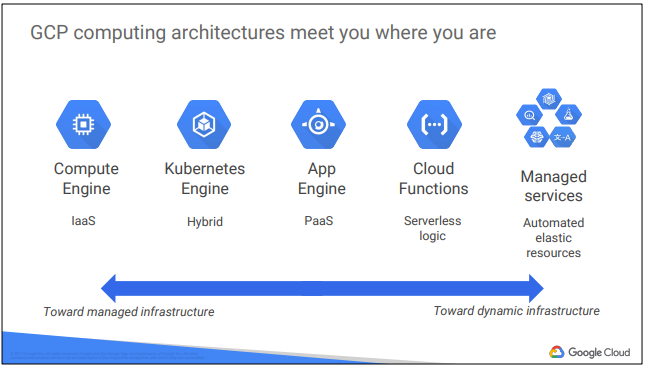
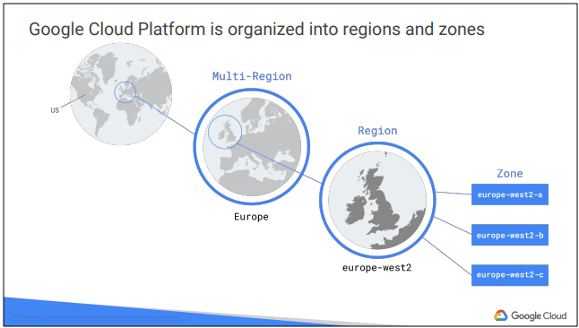
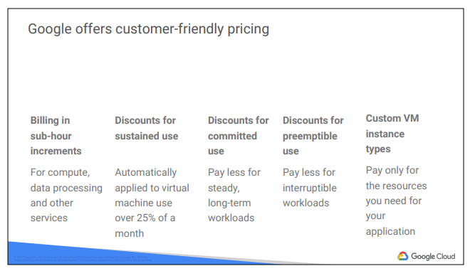

## __Introduction to Google Cloud Platform__

## What is cloud computing?

Cloud computing has five fundamental attributes, according to the definition of cloud computing proposed by the United States National Institute of Standards and Technology. 

On-demand self-service Resource pooling
-  No human intervention needed to get resources

Broad network access Rapid elasticity
- Access from anywhere

Resource Pooling
- Provider shares resources to customers

Rapid Elasticity
- Get more resources quickly as needed

Measured service
- Pay only for what you consume

## How did we get here? Where are we going?

Physical/Colo - User-configured, managed, and maintained

Virtualized - User-configured
Provider-managed and maintained

Serverless - Fully automated

## GCP computing architectures meet you where you are
----

----

Virtualized data centers brought you infrastructure as a service (IaaS) and platform as
a service (PaaS) offerings. IaaS offerings provide you with raw compute, storage, and
network, organized in ways familiar to you from physical and virtualized data centers.
PaaS offerings, on the other hand, bind your code to libraries that provide access to
the infrastructure your application needs, thus allow you to focus on your application
logic.

## Google Cloud Platform is organized into regions and zones

Regions and zones
Regions are independent geographic areas that consist of zones. Locations within
regions tend to have round-trip network latencies of under 5 milliseconds on the 95th
percentile.
A zone is a deployment area for Google Cloud Platform resources within a region.
Think of a zone as a single failure domain within a region. In order to deploy
fault-tolerant applications with high availability, you should deploy your applications
across multiple zones in a region to help protect against unexpected failures.

## Google offers customer-friendly pricing

Google was the first major cloud provider to deliver per-second billing for its
Infrastructure-as-a-Service compute offering, Google Compute Engine. Per-second
billing is offered for users of Compute Engine, Kubernetes Engine (container
infrastructure as a service), Cloud Dataproc (the open-source Big Data system
Hadoop as a service), and App Engine flexible environment VMs (a Platform as a
Service).
Google Compute Engine offers automatically applied sustained-use discounts, which
are automatic discounts that you get for running a virtual-machine instance for a
significant portion of the billing month. Specifically, when you run an instance for
more than 25% of a month, Compute Engine automatically gives you a discount for
every incremental minute you use for that instance.
Custom virtual machine types allow Google Compute Engine virtual machines to be
fine-tuned for their applications, so that you can tailor your pricing for your workloads.

## Google Cloud Platform offers services for getting value from data

Google Cloud Platform’s products and services can be broadly categorized as
Compute, Storage, Big Data, Machine Learning, Networking, and
Operations/Tools. This course considers each of the compute services and discuss
why customers might choose each
