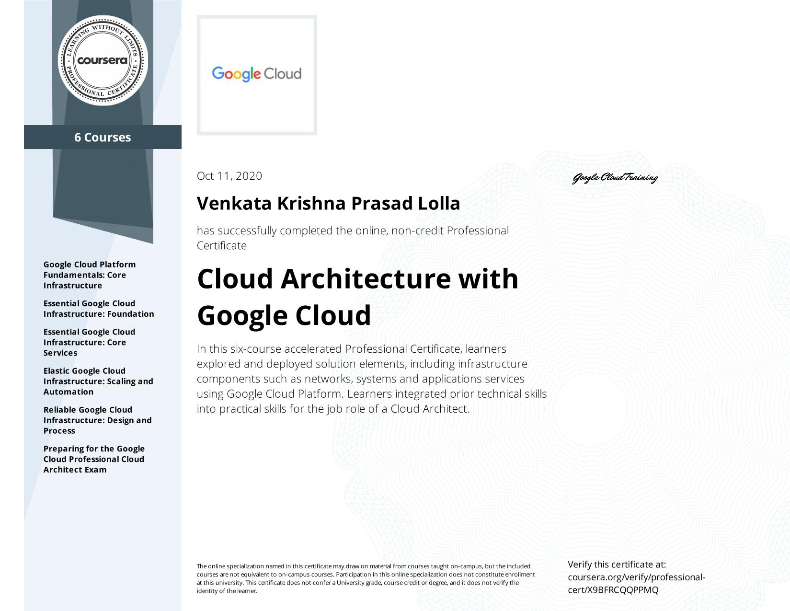
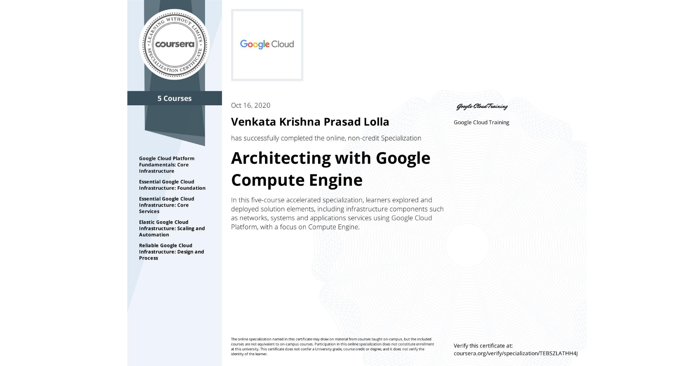

#  Cloud Architecture with Google Cloud Professional Certificate - Preperation

A Professional Cloud Architect enables organizations to leverage Google Cloud technologies. With a thorough understanding of cloud architecture and Google Cloud Platform, this individual can design, develop, and manage robust, secure, scalable, highly available, and dynamic solutions to drive business objectives.

Click [here](https://github.com/vlolla/google-cloud/blob/master/Cloud%20Architecture%20with%20Google%20Cloud%20Professional%20Certificate.md) for more detail documentation of this course progress

https://www.coursera.org/account/accomplishments/specialization/certificate/X9BFRCQQPPMQ

#  Architecting with Google Compute Engine Specialization

This professional certificate incorporates hands-on labs using our Qwiklabs platform.

These hands on components will let you apply the skills you learn. Projects incorporate Google Cloud Platform products, used within Qwiklabs. You will gain practical hands-on experience with the concepts explained throughout the modules.

New! CERTIFICATE COMPLETION CHALLENGE from Coursera and Google Cloud

https://www.coursera.org/account/accomplishments/specialization/certificate/TEBSZLATHH4J

# Architecting Hybrid Cloud Infrastructure with Anthos Specialization - Preperation

This specialization is intended for technical engineers, architects, and administrators using Google Cloud Platform (GCP), Kubernetes, and Istio to create, integrate, or modernize solutions. You will learn modernizing, managing, and observing microservices-based applications that span multiple clusters in GCP, on-premises, or other cloud providers.

Click [here](https://github.com/vlolla/google-cloud/tree/master/Architecting%20Hybrid%20Cloud%20Infrastructure%20with%20Anthos%20Specialization) for more detail documentation of this course progress
